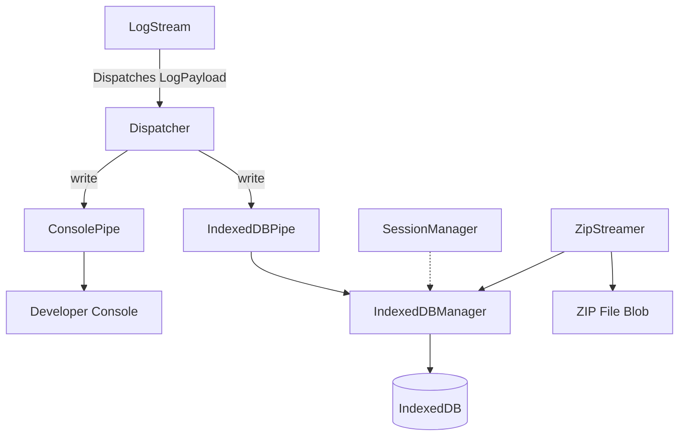

<h1 align="center">WME LogStream</h1>

<p align="center">
  <b>A lightweight, structured logging and persistence library for Waze Map Editor (WME) userscripts and extensions.</b>
</p>

<p align="center">
  <a href="https://github.com/TheEditorX/wme-logstream/actions"></a>
  <a href="https://www.npmjs.com/package/@editor-x/wme-logstream"></a>
  <a href="http://www.apache.org/licenses/LICENSE-2.0"></a>
  <a href="https://www.typescriptlang.org/"></a>
</p>

---

## 📖 Overview

**WME LogStream** is an asynchronous logging framework designed for developers building userscripts and extensions for the **Waze Map Editor (WME)**.

It handles console branding, multi-tab safe IndexedDB persistence, state delta diffing, and log exporting with a unified, zero-boilerplate API.

### Key Features

- 🌲 **Hierarchical Scoping**: Scope loggers to specific components (e.g., `[MyScript] [API] [Auth]`).
- 🎨 **Custom Console Styling**: Style console output with custom brand colors and prefixes.
- 💾 **Asynchronous Persistence**: Buffers and persists logs locally to IndexedDB in the background.
- 👥 **Multi-Tab Isolation**: Prevents session collisions when the editor is open in multiple browser tabs.
- ⚡ **State Delta Tracking**: Deep-diff state objects over time and log only modified properties.
- 📦 **Zip Archive Export & Download**: Bundle and download stored log sessions directly from the browser.

---

## 📐 Architecture

The library decouples logging API interactions from storage and console outputs:



---

## 🚀 Installation

### 1. For Bundled Scripts and Extensions

Install via npm for projects using a bundler (Webpack, Rollup, Vite):

```bash
npm install wme-logstream
```

Then import `LogStream` in your modules:

```typescript
import { LogStream } from 'wme-logstream';
```

### 2. For Userscripts (Tampermonkey / Violentmonkey)

To load the pre-built global IIFE library directly in your userscript, import it using **jsDelivr** pointing to the npm package:

```javascript
// @require https://cdn.jsdelivr.net/npm/editor-x/wme-logstream@latest/dist/index.iife.js
```

The library will be available on the global `window` object as `EditorXLogStream`.

---

## ⚡ Quick Start

### 1. Simple Console Logging

If you only want customized console logging, setup is synchronous and instant:

```typescript
import { LogStream } from 'wme-logstream';

const logger = LogStream.create({
  minLogLevel: 'DEBUG',
  brand: {
    prefix: 'MyScript',
    color: '#00E676',
  },
});

logger.info('Logger initialized.');
logger.debug('Fetching details...', { segmentId: 12345 });
```

### 2. Logging with IndexedDB Persistence & Multi-Tab Isolation

To automatically persist log history in IndexedDB with safe multi-tab isolation, simply toggle `persist: true`. The library handles the asynchronous database and session setup in the background:

```typescript
import { LogStream } from 'wme-logstream';

const logger = LogStream.create({
  minLogLevel: 'DEBUG',
  persist: true,
  dbPrefix: 'MyScriptDB',
  scriptVersion: '1.0.0',
  wmeSDK: (window as any).WazeMapEditorSDK, // optional
  brand: { prefix: 'MyScript' },
});

// Logs are safely buffered and queued immediately on page load!
logger.info('Script loaded and database logging is active.');
```

---

## 🛠️ Advanced Usage

### 1. Hierarchical Scoping

Loggers can be nested to show context hierarchies:

```typescript
const apiLogger = logger.scope('API');
const authLogger = apiLogger.scope('Auth');

logger.info('Starting...'); // [MyScript] [INFO] Starting...
apiLogger.debug('Connecting'); // [MyScript] [DEBUG][API] Connecting
authLogger.error('Failed'); // [MyScript] [ERROR][API][Auth] Failed
```

### 2. State Delta Tracking

Track state mutations over time by logging only differences. You can create a state tracker function:

```typescript
const trackSettings = logger.createStateTracker('editorSettings');
const state = { theme: 'dark', visibleLayers: ['segments'] };

// Initial state call logs the base state
trackSettings(state);

// Subsequent calls calculate and log only the changed properties
trackSettings({ theme: 'light', visibleLayers: ['segments'] });
// Logs only: { theme: ['dark', 'light'] }
```

### 3. Log Exports (ZIP Download)

Provide users with a simple way to download troubleshooting logs as a compressed ZIP file directly in the browser:

```typescript
// Triggers a browser download of a zipped archive of all archived log sessions
await logger.downloadLogs('my-script-logs.zip');
```

If you need to retrieve the raw compressed Blob (e.g. to upload to a remote server instead of downloading it):

```typescript
const zipBlob = await logger.exportLogs();
```

---

## ⚙️ API Configuration Reference

### `LogStream.create(config)`

| Property              | Type                                                                      | Default                       | Description                                                            |
| :-------------------- | :------------------------------------------------------------------------ | :---------------------------- | :--------------------------------------------------------------------- |
| `minLogLevel`         | `'TRACE' \| 'DEBUG' \| 'INFO' \| 'WARN' \| 'ERROR' \| 'FATAL'`            | `'INFO'`                      | Minimum level of severity required to log.                             |
| `persist`             | `boolean`                                                                 | `false`                       | Enable/disable background IndexedDB persistence.                       |
| `dbPrefix`            | `string`                                                                  | _Required if persist is true_ | Name prefix for the IndexedDB database.                                |
| `scriptVersion`       | `string`                                                                  | _Required if persist is true_ | Current version of your script/extension.                              |
| `wmeSDK`              | [`WmeSDK`](https://www.waze.com/editor/sdk/classes/index.SDK.WmeSDK.html) | `undefined`                   | Native WME SDK instance to query editor versions.                      |
| `maxArchivedSessions` | `number`                                                                  | `15`                          | Maximum number of archived database sessions to preserve.              |
| `flushIntervalMs`     | `number`                                                                  | `2000`                        | Asynchronous log flush rate to IndexedDB (in ms).                      |
| `brand`               | `ConsolePipeConfig \| null`                                               | `undefined`                   | Custom branding config for console outputs (set to `null` to disable). |

#### `ConsolePipeConfig`

| Property       | Type     | Default     | Description                          |
| :------------- | :------- | :---------- | :----------------------------------- |
| `scriptPrefix` | `string` | `'EditorX'` | Tag prefix displayed in log entries. |
| `brandColor`   | `string` | `'#00E676'` | Hex color of the brand prefix.       |

---

## 🧪 Development

Install dependencies:

```bash
npm install
```

Available scripts:

```bash
npm run build        # Build package distributions (ESM, CJS, IIFE)
npm run test         # Run unit tests
npm run lint         # Run ESLint validation
npm run format       # Run Prettier format check and fixes
```

---

## 📄 License

This project is licensed under the **Apache-2.0 License**. See the `LICENSE` file for details.
